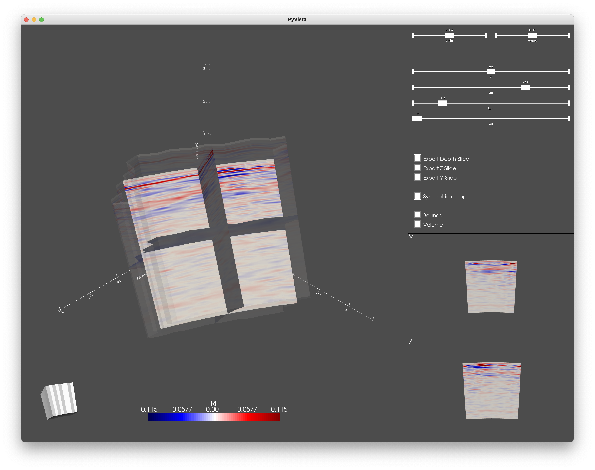
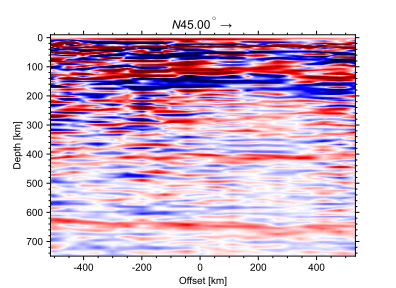
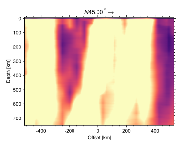
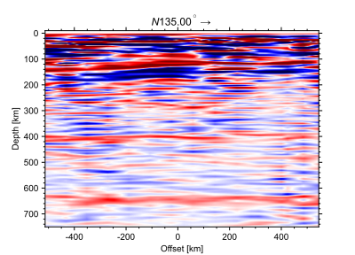
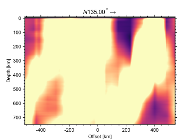

Usage
-----

Below different usage examples:

Read and Plot Spherical Plot in window to explore
+++++++++++++++++++++++++++++++++++++++++++++++++

.. code-block:: python
    
    from meshslice import read_mesh, MeshPlotSph

    # Read mesh
    M = read_mesh("tests/data/test.vtu")

    # Open explorer
    MeshPlotSph(M)

Reproducible slices through a 3D volume
+++++++++++++++++++++++++++++++++++++++

Compare slices of two datatypes. Here, ``illumination`` and ``RF``.

.. code-block:: python

    from meshslice import read_mesh, MeshPlotSph

    # Read mesh
    M = read_mesh("tests/data/test.vtu")

    locations = dict(
        lat=42.8, 
        lon=-119.0, 
        rotangle=45.0, 
        depth=660
    )

    illum_cdict = dict(
        meshname='illumination', 
        cmapname='magma', 
        clim = [100, 1200]
    )

    RF_cdict = dict(
        meshname='RF', 
        cmapname='seismic', 
        clim = [-0.02, 0.02]    
    )

    MeshPlotSph(M, **locations, **illum_cdict, figures_only=True, fmt='svg')
    MeshPlotSph(M, **locations, **RF_cdict, figures_only=True, fmt='svg')

.. image:: sampleplots/depthslice660_RF.svg
.. image:: sampleplots/depthslice660_illumination.svg

